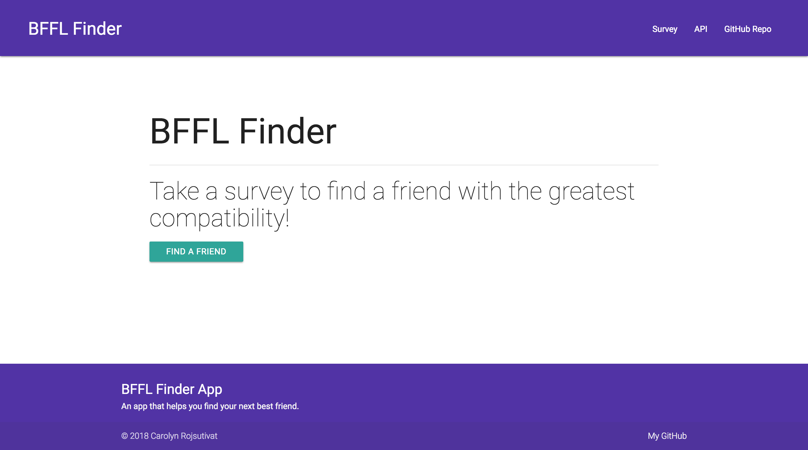

# BFFL Finder - Friend Finder App
An app created using Node.js, Express, Body Parser, and Path to find a friend that you're most compatible with.

## Screenshots

Home page

The Survey

Result

## Tech/framework used

<b>Built with</b>
- [Node.js](https://nodejs.org/en/)
- [Express](https://expressjs.com/)
- [Body Parser](https://github.com/expressjs/body-parser)
- [Path](https://www.npmjs.com/package/path)

## License

Northwestern University © [Carolyn Rojsutivat]()